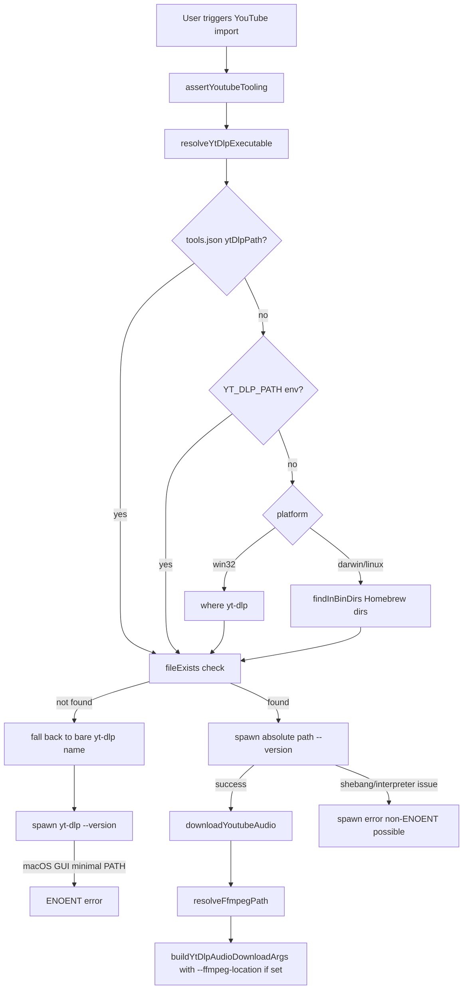

# macOS yt-dlp / ffmpeg Tooling Audit

**Date:** 2026-06-10  
**Scope:** Audit of `YoutubeTooling.ts` refactor (commit `fb4446a`), cross-platform tool discovery behavior, and macOS 27 (Golden Gate) developer beta compatibility.  
**Constraint:** Findings only — no code changes in this document or PR.

---

## Executive summary

The reported `spawn yt-dlp ENOENT` failures on macOS are **very unlikely to be caused by a new macOS 27–specific subprocess or PATH regression**. Apple's official [macOS Golden Gate 27 Beta Release Notes](https://developer.apple.com/documentation/macos-release-notes/macos-27-release-notes) contain **no documented changes** to `PATH` inheritance, `posix_spawn`, `NSTask`, or GUI application environment handling that would explain this behavior.

The dominant root cause is a **long-standing macOS platform behavior**: GUI applications launched from Finder/Dock/Spotlight (including Ableton Live) inherit a **minimal environment** from `launchd`, not the interactive shell `PATH` configured in `~/.zprofile` or `~/.zshrc`. Terminal sessions show `/opt/homebrew/bin` on `PATH`; Ableton's Node extension host typically does not.

Commit `fb4446a` ("Updated the extension to now support MAcOS tooling") partially addresses this by probing fixed Homebrew paths before falling back to bare command names. That fix is directionally correct but **incomplete**: it does not cover all install layouts, does not augment `PATH` for child processes, does not verify executability, and still falls back to `"yt-dlp"` (which requires `PATH`) when probing fails.

Windows works more reliably because the extension uses `where` via `execSync`, which resolves against the Windows process environment and PATHEXT semantics — a fundamentally different (and more forgiving) discovery path.

**Most likely explanation for the original reporter:** they were on a pre-`0.1.3` build that only tried the bare `"yt-dlp"` name on macOS, or their binaries are not at `/opt/homebrew/bin` / `/usr/local/bin`. **Most likely explanation for intermittent success (@echopierce):** a working `tools.json` override combined with extension reinstall/restart, not automatic detection.

---

## Methodology

1. Read current and pre-refactor `ThirdAbletonProject/src/youtubeTooling.ts`, `toolsConfig.ts`, `youtubeDownload.ts`, and `extension.ts`.
2. Reviewed commit `fb4446a` diff and unit tests in `tests/youtubeTooling.test.ts`.
3. Consulted Ableton Extensions SDK docs for `storageDirectory`, extension execution model, and filesystem access.
4. Reviewed official Apple release notes:
   - [macOS Tahoe 26 Release Notes](https://developer.apple.com/documentation/macos-release-notes/macos-26-release-notes)
   - [macOS Tahoe 26.5 Release Notes](https://developer.apple.com/documentation/macos-release-notes/macos-26_5-release-notes)
   - [macOS Golden Gate 27 Beta Release Notes](https://developer.apple.com/documentation/macos-release-notes/macos-27-release-notes)
   - [Apple Developer Releases — macOS 27 beta (26A5353q), June 8, 2026](https://developer.apple.com/news/releases/?id=06082026d)
5. Cross-referenced widely reported GUI-vs-Terminal `PATH` behavior on modern macOS (Sequoia/Tahoe era).

---

## How the extension discovers tools

### Resolution order (both platforms)

For **yt-dlp**, `resolveYtDlpExecutable()` builds a candidate list in this order:

| Priority | Source | macOS | Windows |
|----------|--------|-------|---------|
| 1 | `tools.json` → `ytDlpPath` | Yes | Yes |
| 2 | `process.env.YT_DLP_PATH` | Yes | Yes |
| 3 | Platform probe | `findInBinDirs` in `/opt/homebrew/bin`, `/usr/local/bin` | `where yt-dlp` via `execSync` |
| 4 | Fallback bare name | `"yt-dlp"` | `"yt-dlp.exe"`, then `"yt-dlp"` |

The first candidate that passes `fileExists()` (filesystem `access` check) wins and is cached in module-level `cachedYtDlp`.

For **ffmpeg**, `resolveFfmpegPath()` uses:

| Priority | Source | macOS | Windows |
|----------|--------|-------|---------|
| 1 | `tools.json` → `ffmpegPath` | Yes | Yes |
| 2 | `process.env.FFMPEG_PATH` | Yes | Yes |
| 3 | Platform probe | `findInBinDirs` in Homebrew dirs | `where ffmpeg` |
| 4 | Fallback | `null` (optional) | `null` |

When ffmpeg resolves to a path, `youtubeDownload.ts` passes `--ffmpeg-location <path>` to yt-dlp. When it returns `null`, yt-dlp must find ffmpeg on its own via **its inherited `PATH`** — which is again minimal inside Ableton.

### How tools are executed

Both `assertYoutubeTooling()` and `downloadYoutubeAudio()` use Node's `child_process.spawn()` with:

```ts
{ shell: false, windowsHide: true }
```

No custom `env`, `cwd` (except download steps), or `PATH` augmentation is passed. Child processes inherit Ableton/extension-host environment as-is.

`assertYoutubeTooling()` validates yt-dlp by spawning `<resolved-executable> --version`.

### `tools.json` location

Loaded from:

```
<context.environment.storageDirectory>/tools.json
```

The post-refactor error hint dynamically prints this path when `storageDirectory` is available. This is important because users may have created `tools.json` in the wrong directory (e.g. project `.storage` from dev mode vs Ableton's per-extension storage in production).

---

## Refactor analysis (`fb4446a`)

### What changed

| Area | Before (`fb4446a^`) | After (`fb4446a`) |
|------|---------------------|-------------------|
| macOS yt-dlp discovery | Only bare `"yt-dlp"` (requires `PATH`) | Probes `/opt/homebrew/bin/yt-dlp` and `/usr/local/bin/yt-dlp` |
| macOS ffmpeg discovery | Always `null` unless override/env | Probes same Homebrew dirs for `ffmpeg` |
| Error messages | Static Windows-centric `TOOLING_HINT` | Platform-aware `getToolingHint()` with macOS Homebrew instructions and `tools.json` path |
| Tests | None for discovery | `findInBinDirs` unit tests |
| Windows behavior | Unchanged (`where` + fallbacks) | Unchanged |

### What did **not** change

- No shell `PATH` resolution (e.g. `zsh -ilc 'echo $PATH'`).
- No `which` / `command -v` on macOS.
- No `env: { PATH: ... }` passed to `spawn`.
- No executable-bit (`X_OK`) validation.
- No logging of resolved paths or `process.env.PATH` for diagnostics.
- `manifest.json` version still `"0.1.0"` (see Version mismatch below).

### Assessment of the refactor

**Strengths:**
- Correctly identifies the core macOS issue (GUI apps lack shell `PATH`).
- Hardcoded Homebrew paths cover the majority of Apple Silicon Homebrew installs.
- Platform-specific error hints are substantially better for macOS users.
- ffmpeg auto-discovery on macOS was previously missing entirely.

**Weaknesses:**
- Still relies on bare `"yt-dlp"` fallback when Homebrew probing fails — reproduces original `ENOENT`.
- Only two directories probed; misses MacPorts (`/opt/local/bin`), Nix, `~/.local/bin` (pip), custom prefixes.
- `fileExists()` uses `fs.accessSync` without `fs.constants.X_OK` — a non-executable file could be "found" then fail at spawn time.
- Module-level cache (`cachedYtDlp`) never invalidates; a bad first resolution persists for the extension lifetime.
- `spawn` does not pass augmented `PATH`; if yt-dlp is a script whose shebang points to an interpreter only on Homebrew `PATH`, secondary failures are possible even with an absolute yt-dlp path.

---

## Windows vs macOS: why Windows works

| Factor | Windows | macOS (Ableton GUI) |
|--------|---------|---------------------|
| Default `PATH` in GUI apps | Often includes user + machine paths from registry | Typically minimal: `/usr/bin:/bin:/usr/sbin:/sbin` (plus some system paths) |
| Discovery mechanism | `where yt-dlp` shells out and returns first existing path | Filesystem probe of two fixed directories only |
| Bare name fallback | `CreateProcess` + PATHEXT resolves `.exe` without shell | `posix_spawn` requires absolute path or `PATH` lookup |
| User workaround surface | `tools.json`, env vars, PATH restart | Same, but PATH restart **often ineffective** for GUI apps on modern macOS |
| Package managers | winget adds to PATH; Windows GUI inherits more reliably | Homebrew modifies shell profiles; **does not automatically fix GUI `PATH`** |

The original issue report's error text (`spawn yt-dlp ENOENT` with Windows PowerShell instructions) matches the **pre-refactor** macOS code path exactly: bare `"yt-dlp"` with no Homebrew probing.

---

## macOS 27 developer beta sanity check

### Release context

- **Reported OS:** macOS 26.5.1 (Tahoe) and macOS 27 developer beta (@echopierce, post–June 8, 2026).
- **macOS 27 beta:** "Golden Gate", build `26A5353q`, [released June 8, 2026](https://developer.apple.com/news/releases/?id=06082026d).

### Relevant items in official macOS 27 beta release notes

After reviewing the full [macOS 27 Beta Release Notes](https://developer.apple.com/documentation/macos-release-notes/macos-27-release-notes), **none** of the documented changes target:

- `PATH` / `launchctl setenv PATH` / `/etc/paths`
- `posix_spawn`, `execve`, `NSTask`, or `Process` spawning
- Node.js, extension hosts, or Ableton-specific behavior
- Homebrew / `/opt/homebrew` access restrictions

Potentially adjacent (but **not** a direct match for `spawn yt-dlp ENOENT`):

| macOS 27 item | Relevance to this issue |
|---------------|-------------------------|
| **Launch Daemons and Agents:** `launchd` no longer loads plists with quarantine xattr | Could break user-created LaunchAgents that set `PATH` for GUI apps if quarantined — would make workarounds *harder*, not cause extension regression by itself |
| **Rosetta:** not auto-restored after upgrade; Intel software deprecation warnings | Only relevant if yt-dlp/ffmpeg are x86-only binaries without arm64 build |
| **Gaming:** `game-test-tool enable` disables Rosetta | Unrelated unless user enabled this beta-only tool |
| **Network Security:** stricter TLS for MDM/update processes | Unrelated to local subprocess spawn |
| **Accessory Access does not work inside App Sandbox** | Worth monitoring if Ableton sandboxes extensions in future; no evidence in current SDK docs |

### macOS 26 / Tahoe notes (reporter's 26.5.1)

The [macOS 26 release notes](https://developer.apple.com/documentation/macos-release-notes/macos-26-release-notes) also contain no PATH/spawn changes. Notable Tahoe additions (Launch Angels, Game Mode `open` workaround for env vars) do not affect generic CLI tool spawning from Node.

### Broader macOS platform trend (pre-27)

Community and technical write-ups (not Apple official) report that on **macOS 15 Sequoia and later**:

- `launchctl setenv PATH "$PATH"` from Terminal **no longer reliably propagates `PATH` to GUI apps** (still works for other env vars).
- `sudo launchctl config user path ...` has regressed (SIGBUS reports on Sequoia).

This means user attempts to fix the issue via `/etc/paths`, `.zprofile`, or `launchctl setenv PATH` — as described in the GitHub issue — are **expected to fail or be inconsistent** on Tahoe 26.x and Golden Gate 27.x. That aligns with the reporter's experience, but it is **not a new macOS 27 regression**; it is continued/extended separation between shell and GUI environments.

### Verdict: macOS 27 beta

> **No evidence in Apple's official macOS 27 beta documentation of a change that would specifically break the extension's ability to spawn yt-dlp/ffmpeg, beyond the longstanding GUI `PATH` limitation that the extension is designed to work around via absolute paths.**

Intermittent behavior on macOS 27 beta is more plausibly explained by extension version, `tools.json` state, caching, or beta instability elsewhere — not a documented Apple API break.

---

## Root cause analysis

### Primary root cause (high confidence)

**Ableton Live's extension Node host inherits a minimal `PATH`, while the refactor (when it works) depends on finding binaries at fixed absolute paths or via user overrides.**

The error `spawn yt-dlp ENOENT` specifically indicates the resolved executable was the **bare name** `"yt-dlp"`, not `/opt/homebrew/bin/yt-dlp`. That means:

1. No valid `tools.json` / env override was loaded, **and**
2. `findInBinDirs("yt-dlp", ["/opt/homebrew/bin", "/usr/local/bin"])` returned `null`, **and**
3. `fileExists("yt-dlp")` in the current working directory also failed.

### Contributing factors

1. **Pre-0.1.3 builds** — No Homebrew probing at all on macOS.
2. **Version display mismatch** — `manifest.json` says `0.1.0` while GitHub release is `0.1.3`; users may think they updated when Ableton still shows an old version.
3. **`tools.json` in wrong directory** — Must be in Ableton-provided `storageDirectory`, not the dev `.storage` folder (unless running via `extensions-cli` with `--storage-directory .storage`).
4. **Install location outside probed dirs** — pip (`~/.local/bin`), MacPorts, Nix, custom `HOMEBREW_PREFIX`.
5. **No `PATH` for yt-dlp's own children** — If ffmpeg is not passed via `--ffmpeg-location` and is not on inherited `PATH`, downloads can fail even after yt-dlp itself runs.
6. **`cachedYtDlp` stickiness** — Failed or partial resolution can persist until extension reload.
7. **User PATH workarounds ineffective on modern macOS** — Editing `.zprofile`, `/etc/paths`, or `launchctl setenv PATH` does not reliably affect GUI-launched Ableton.

### Why @echopierce got it working once

The combination of editing `/etc/paths`, `tools.json`, and reinstalling the extension is consistent with:

- **Absolute paths in `tools.json`** being the actual fix (bypasses all `PATH` issues for yt-dlp; ffmpeg if also specified).
- **Extension reload** clearing `cachedYtDlp` or picking up new `tools.json`.
- **Intermittent failure afterward** if `tools.json` was removed, path wrong, ffmpeg not specified and not found, or a download failed for unrelated reasons (network, yt-dlp update, beta OS noise).

Automatic detection "still not working" on macOS 27 beta fits the **incomplete Homebrew probe list**, not a new Apple subprocess API break.

---

## Code flow diagram



---

## Version mismatch (separate UX issue)

| Location | Version |
|----------|---------|
| `ThirdAbletonProject/manifest.json` | `0.1.0` |
| GitHub release tag cited by maintainer | `0.1.3` |

Ableton displays the manifest version in extension settings. Users on the `0.1.3` release artifact may still see `0.1.0` in the UI (@echopierce observation). This does not cause `ENOENT` but **impairs troubleshooting** and makes it hard to confirm the macOS tooling fix is actually installed.

---

## Test coverage gaps (observational)

Current tests (`tests/youtubeTooling.test.ts`) only cover `findInBinDirs` with temporary directories. There are **no tests** for:

- `resolveYtDlpExecutable` / `resolveFfmpegPath` integration
- Platform-specific branches
- `assertYoutubeTooling` error message content
- Behavior when `storageDirectory` is set vs unset
- `cachedYtDlp` caching semantics

---

## Recommendations (for a future implementation PR — not in scope here)

Ordered by expected impact:

1. **Never spawn bare `yt-dlp` on macOS** — If no absolute path is resolved, fail immediately with the detailed hint (avoid misleading `ENOENT`).
2. **Expand probe directories** — At minimum: `/opt/homebrew/bin`, `/usr/local/bin`, `/opt/local/bin` (MacPorts), `~/.local/bin`. Consider reading `/etc/paths` and `/etc/paths.d/*`.
3. **Resolve shell `PATH` once at startup (macOS)** — Pattern used by Electron apps: `execFileSync(process.env.SHELL || '/bin/zsh', ['-ilc', 'echo -n "$PATH"'])` with timeout and fallback to known dirs.
4. **Pass augmented `env.PATH` to all `spawn` calls** — Include Homebrew dirs plus inherited `process.env.PATH` so yt-dlp scripts and child processes (ffmpeg, python) resolve correctly.
5. **Validate executability** — Use `fs.accessSync(path, fs.constants.X_OK)` not just existence.
6. **Add diagnostic logging** — Log resolved paths, probe results, and truncated `process.env.PATH` to extension logs (not user-facing dialog).
7. **Bump `manifest.json` version** — Match release tags to reduce user confusion.
8. **Document `tools.json` path clearly in README/INSTALL** — Include screenshot-level instructions for finding `storageDirectory` in production Ableton.

---

## References

### Project files

- `ThirdAbletonProject/src/youtubeTooling.ts` — tool resolution and spawn
- `ThirdAbletonProject/src/toolsConfig.ts` — `tools.json` loading
- `ThirdAbletonProject/src/youtubeDownload.ts` — yt-dlp/ffmpeg usage during download
- `ThirdAbletonProject/src/extension.ts` — `assertYoutubeTooling` gate before import
- Commit `fb4446a` — macOS tooling refactor

### Apple official

- [macOS Golden Gate 27 Beta Release Notes](https://developer.apple.com/documentation/macos-release-notes/macos-27-release-notes)
- [macOS Tahoe 26 Release Notes](https://developer.apple.com/documentation/macos-release-notes/macos-26-release-notes)
- [macOS Tahoe 26.5 Release Notes](https://developer.apple.com/documentation/macos-release-notes/macos-26_5-release-notes)
- [macOS 27 beta (26A5353q) — Apple Developer Releases, June 8, 2026](https://developer.apple.com/news/releases/?id=06082026d)

### Ableton Extensions SDK

- `context.environment.storageDirectory` — persistent config location for `tools.json`
- Extension execution via Node `child_process.spawn` inside Live host process

### Platform behavior (supplementary)

- GUI apps on macOS do not inherit shell `PATH` from `~/.zprofile` / `~/.zshrc` (launchd session model)
- Reports of `launchctl setenv PATH` becoming ineffective for GUI apps on macOS 15+ (Sequoia/Tahoe era)
- Node `spawn ENOENT` occurs when executable cannot be resolved via absolute path or `PATH` ([Node.js child_process documentation](https://nodejs.org/api/child_process.html))

---

## Conclusion

The macOS tooling failures described in the GitHub issue are **consistent with known GUI-vs-Terminal environment differences on modern macOS**, amplified by the extension's pre-refactor reliance on bare command names. Commit `fb4446a` is a meaningful partial fix but leaves important gaps. **macOS 27 developer beta does not introduce a documented, specific new mechanism that would explain tool communication breaking on Mac but not Windows**; the Windows code path has always been more robust (`where` + PATHEXT). The most reliable user-side workaround today remains **`tools.json` with absolute paths** in the correct `storageDirectory`; the most reliable code-side fix (future work) is **absolute-path-only spawning with expanded discovery and explicit `PATH` for child processes**.
